# ** Winpea World - Jewellery Store ** 
 

Developer: **Lewis Hazelwood**

Deployed Site:
[Winpea world - site](https://winpea-world-560ce7552450.herokuapp.com/)

## Table of Contents
  - [About](#about)
  - [User Goals](#user-goals)
  - [Site Owner Goals](#site-owner-goals)
  - [User Experience](#user-experience)
  - [User Stories](#user-stories)
  - [Design](#design)
    - [Colours](#colours)
    - [Fonts](#fonts)
    - [Structure](#structure)
      - [Website pages](#website-pages)
      - [Database](#database)
    - [Wireframes](#wireframes)
  - [Technologies Used](#technologies-used)
  - [Features](#features)
  - [Validation](#validation)
  - [Testing](#testing)
    - [Manual testing](#manual-testing)
    - [Automated testing](#automated-testing)
    - [Tests on various devices](#tests-on-various-devices)
    - [Browser compatibility](#browser-compatibility)
  - [Bugs](#bugs)
  - [Heroku Deployment](#heroku-deployment)
  - [Credits](#credits)
  - [Acknowledgements](#acknowledgements)

### About 

Winpea World is a Jewellery brand and store based in Leeds, England (UK). People who are interested in visiting and purchasing products can create an account, book a slot, read through blog posts and view the product catalogue.

## Project Goals

### User Goals
- To create a slot (booking/reservation) for visitng the store
- To be able to view, edit and cancel slots
- To view a catalogue of products
- To be able to contact the business
- To be able to view a blog

### Site Owner Goals
- To attract customers to the store and sell products
- Fully responsive website and ease of access
- Provide a way to book a slot online without need for a phone call.
- Increased online presence in order to boost sales.

## User Experience

### Target Audience
- People who are looking to purchase gifts for their family or friends.
- Past and new customers to our business.
- Tourists to the Leeds area who are shopping around.
- People looking to purchase anniversary gifts.
- Companies/anyone looking to host celebration parties in-store.

### User Requirments and Expectations
- Fully responsive
- Accessibility
- Clear and easy to read webpage
- Social Media
- Contact Information

##### Back to [top](#table-of-contents)

## User Stories

### Users
1. As a User I can navigate across the site so that I can move to each feature of the site easily (Must have)
2. As a User I can view the opening hours and contact details so that I know when the business is open and how to contact them via email, phone and socials (Must have)
3. As a Site Owner I can provide a contact us page so that users can get in touch with my business (Must have)
4. As a User I can use a navbar, footer, and social icons so that I can navigate the site, access menus, and access socials (Must have)
5. As a User I can create a booking by selecting a date and time so that I can reserve my slot (Must have) 
6. As a User I can update my booking so that I can choose another available time and date (Must have)
7. As a User I can delete my booking so that I can cancel my slot (Must have)
8. As a user I can view my booking so that I can remind myself of the date and time I have booked (Must have)
9. As a User I can I am notified so that I know my action of creation, edit, or deletion of a booking has been successful (Must have)
10. As a User I can register as prompted so that I can make a booking if I wish reserve a slot (Must have)
11. As a User I can register to create an account so that my details are stored for faster booking in future (Must have)
12. As a user I can login so that I can book a slot (Must have)
13. As a user I can see my login status so that I know if I am logged in or not (Must have)
14. As a User I can view the site's blog so that I can learn additional information and read articles (Should have)
15. As a User I can view the product catalogue so that I can decide whether to visit the store (Must have)
16. As a User I cannot book a date in the past so that my booking is valid (Must have)
17. As a User I can view blog posts page by page so that I can browse without seeing an overloaded page (Should have)
18. As a User I can not book a slot already booked so that my booking is valid and not double booked (Must have)

### Admin/Authorised Users
19. As an Admin / Authorised User I can log in so that I can access the back end of the site (Must have)
20. As an Admin / Authorised User I can manually add a booking so that I can book a slot if someone phones, or emails the business (Should have)
21. As an Admin / Authorised User I can accept or reject bookings so that we avoid double bookings (Must have)
22. As an Admin I can login to add or remove items from the product catalogue so that we can add more products or remove them (Must have)
23. As a Admin I can create, read, update and delete product item from the database so that we can add, remove, rename and view all our catalogue products (Must have)
24. As an Admin / Authorised User I can search through bookings and menus so that I can find the information I am looking for	 (Should have)
25. As an Admin / Authorised User I can filter bookings by date so that I can see what bookings we have for a particular day (Should have)

### Site Owner
26. As a Site Owner I can provide a fully responsive site for my customers so that they have a good user experience (Must have)
27. As a Site Owner I can validate data entered into my site so that all submitted data is correct to avoid errors (Must have)

# Epics & Kanbans 
- Epics have been used to track chunks of issues categorised into milestones.
- GitHub Kanban was used to track all open user stories.
- Todo, In progress and Done were used to track all issues in the Kanban

Kanban

Epics

User Stories

##### Back to [top](#table-of-contents)

## Design

### Colours

The Winpea brand is a black and white design so for the site I kept with the brighter but simple feel to the sites design.
Upon doing some market research on other brands I was able to discern that simple colour palettes are usually favoured in
the design of Fashion websites.

Colours used include white, grey, black and a light/darker shade of blues for the footer.

### Fonts

Fonts were taken from Google Fonts; I used Playfair Display with sans serif as a backup.

### Structure

#### Website pages

The site has been designed in a way that the user will easily be able to access any page with a navbar at the top to navigate and hamburger menu for
small screen users.

The footer contains links to social media such as an Instagram page which has relevant content on the Winpea brand, this can in turn expand the customer base and boost sales
as it can easily be shared.

- The site consists of the following pages:
  - Homepage with cards for the user to choose to book a slot, view the community blog or our product catalogue
  - Catalogue has a list of all available and unavailable products from the database sorted by bags, necklaces, bracelets, earrings and new.
  - Blog page has a paginated list of blogs posted by an admin or authorised user, 4 per page
  - Blog expanded displays a blog the user has selected so they can read the blog, if they are logged in they can also leave a comment which will then need to be approved before it is displayed
  - Book page allows registered users to book a slot , change guest count, date requested, time requested and a product of interest to notify staff.
  - My bookings displays all bookings for the user that they have made, bookings in the past are automatically expired
  - Edit booking allows the user to change their date, time, product of interest and guest count
  - Cancel booking allows the user to cancel the booking which will then delete it from the database
  - Contact us allows the user to send us a message if the are registered, or they can contact us from the displayed email and phone number or visit the address listed.
  - Login / Logout allows users to login to make bookings, view, edit, and delete bookings
  - Register allows the user to register so they can use the booking system
  - 404 error page to display if a 404 error is raised

#### Database

- Built with Python and the Django framework with a database of a Postgres for the deployed Heroku version(production)
- Two database model shows all the fields stored in the database

Show diagram

##### User Model
The User Model contains the following:
- user_id
- password
- last_login
- is_superuser
- username
- first_name
- last_name
- email
- is_staff
- is_active
- is_banned
- date_joined

#### ProductItem Model
The ProductItem Model contains the following:
- item_id
- item_name
- item_image
- price
- available

#### Slot Model
The Slot Model contains the following:
- slot_id
- max_slots
- available

#### Booking Model
The Booking Model contains the following:
- booking_id (PrimaryKey)
- created_date
- requested_date
- requested_time
- slot (ForeignKey)
- customer (ForeignKey)
- status
- customer_count

#### Post Model (Blog)
- title
- post_id (PrimaryKey)
- author (ForeignKey)
- created_date
- updated_date
- content
- featured_image
- excerpt
- slug
- status

#### Comment Model (Blog)
- post (ForeignKey)
- name
- email
- body
- created_date
- approved
- Meta: created_on

##### ContactUs Model
The ContactUs Model contains the following:
- contact_id (PrimaryKey)
- name (ForeignKey)
- email (ForeignKey)
- phone (ForeignKey)
- body

### Wireframes
The wireframes were created using Balsamiq

## Technologies Used

### Languages & Frameworks
- [Python](https://www.python.org/)
- [Javascript](https://www.javascript.com/)
- [HTML](https://www.w3.org/)
- [CSS](https://www.w3.org/)
- [Django](https://www.djangoproject.com/)
- [Bootstrap](https://getbootstrap.com//)

### Tools

- [Balsamiq](https://balsamiq.com/)
- [Cloudinary](https://cloudinary.com/)
- [Favicon.io](https://favicon.io)
- [Chrome dev tools](https://developers.google.com/web/tools/chrome-devtools/)
- [Font Awesome](https://fontawesome.com/)
- [Google Fonts](https://fonts.google.com/)
- [Heroku Platform](https://id.heroku.com/login)
- [jQuery](https://jquery.com)
- [Postgres](https://www.postgresql.org/)
- [Summernote](https://summernote.org/)
- [Git](https://git-scm.com/)
- [GitPod](https://gitpod.io/)
- [GitHub](https://github.com/)
- Validation:
  - [WC3 Validator](https://validator.w3.org/)
  - [Jigsaw W3 Validator](https://jigsaw.w3.org/css-validator/)
  - [JShint](https://jshint.com/)
  - [Pycodestyle(PEP8)](https://pypi.org/project/pycodestyle/)
  - [Lighthouse](https://developers.google.com/web/tools/lighthouse/)
  - [Wave Validator](https://wave.webaim.org/)

##### Back to [top](#table-of-contents)

## Features

### Home Page
- Home page includes nav bar, main body and a footer.

See feature images

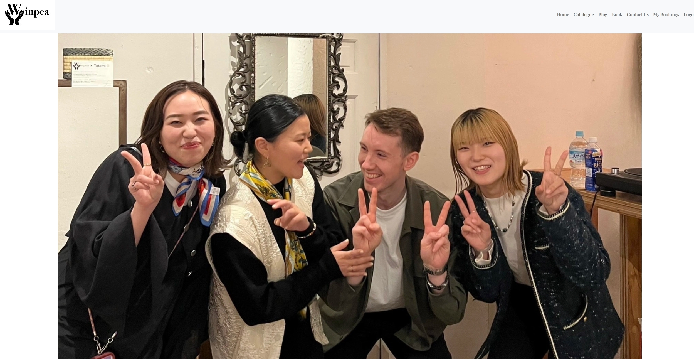

 

### Logo & Navigation
- Custom logo for the business
- Fully Responsive
- On small screens switches to hamburger menu
- Indicates login/logout in status
- Displayed on all pages

See feature images

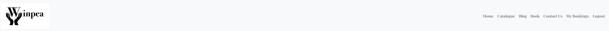
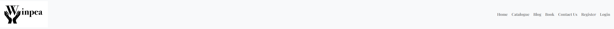
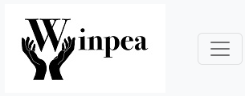

### Footer
- Contains social media links and copyright
- displayed across all pages

See feature images

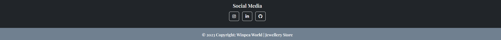

### Sign up / Register
- Allow users to register an acoount
- Username and password is required, email is optional

See feature images

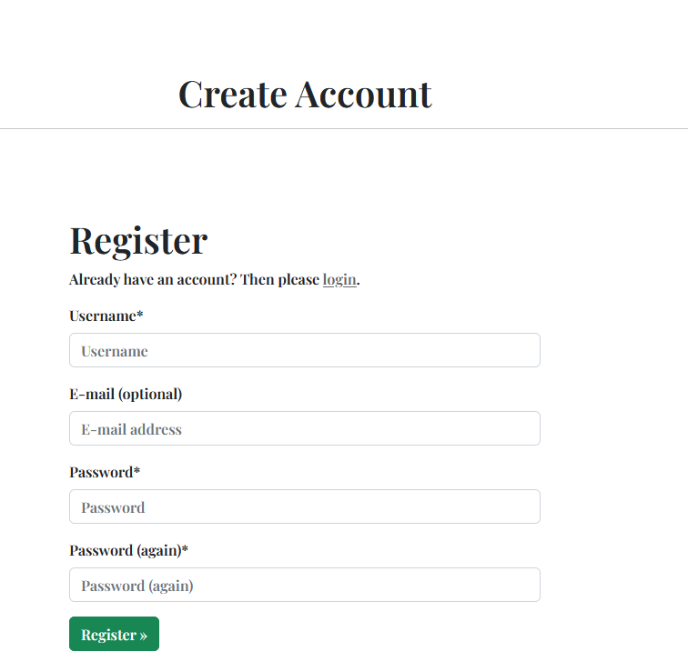

### Login
- User can login to create a booking, view bookings, edit and delete bookings
- User is prompted if they are not entering correct user login details

See feature images

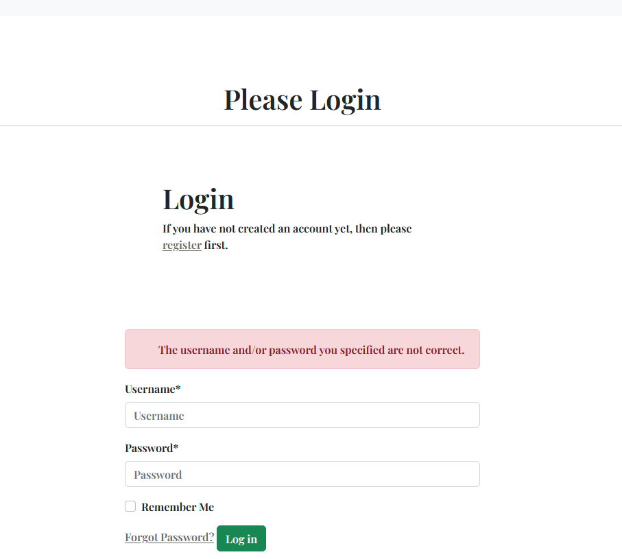
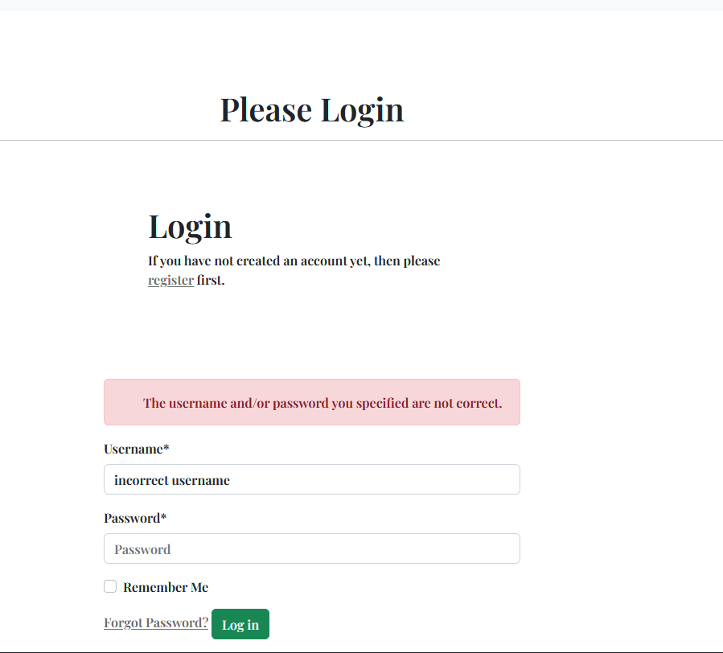

### Logout
- Allows the user to securely log out
- Ask user if they are sure they want to log out

See feature images

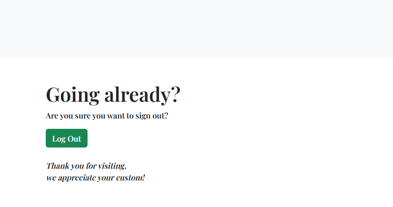

### Book
- Allows the user to book a slot using the booking form
- Messages are displayed if the data is not valid such as phone number lenght is too short and the email address is not a valid format
- Users can see when their booking is successful

See feature images

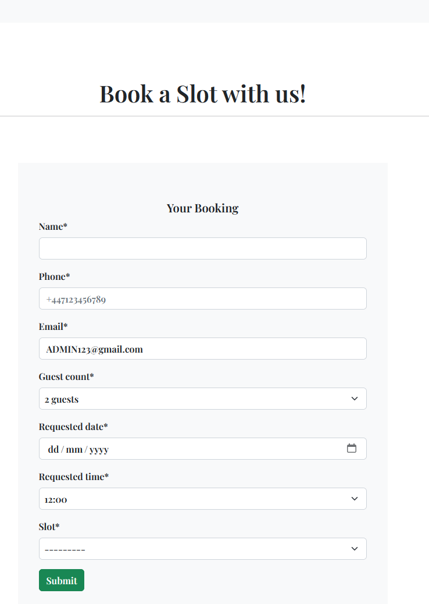
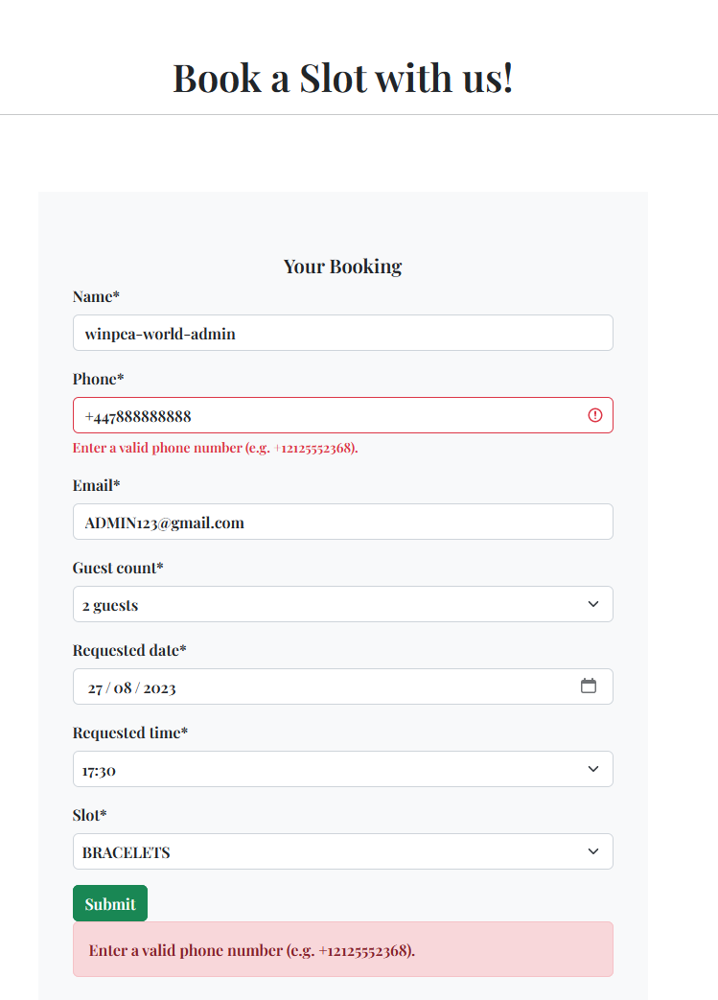
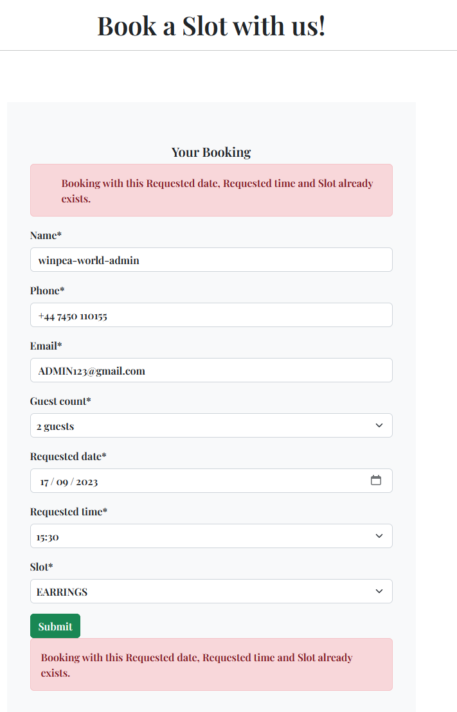

### My Bookings
- Allows the user to see all their bookings in a paginated layout, 4 per page
- If the booking is older than today it is automatically expired for the user
- Status of the booking is displayed, awaiting confirmation and when approved will then change to confirmed status for the user

See feature images

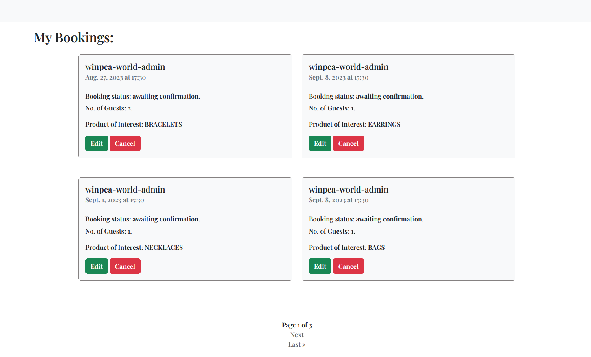

### Edit Booking
- Allows the user to edit their booking to another date, time, guest count and slot

See feature images

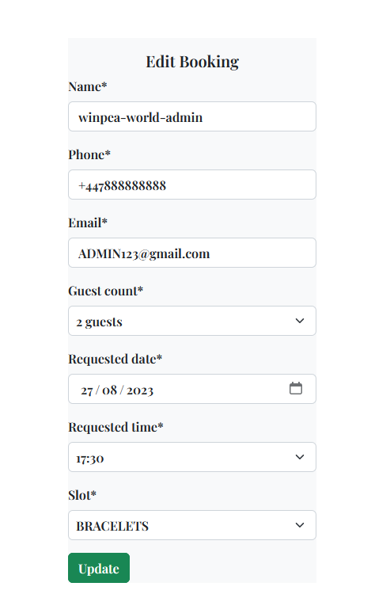

### Cancel Booking 
- Allows the user to cancel their booking, asks user are they sure
  

See feature images

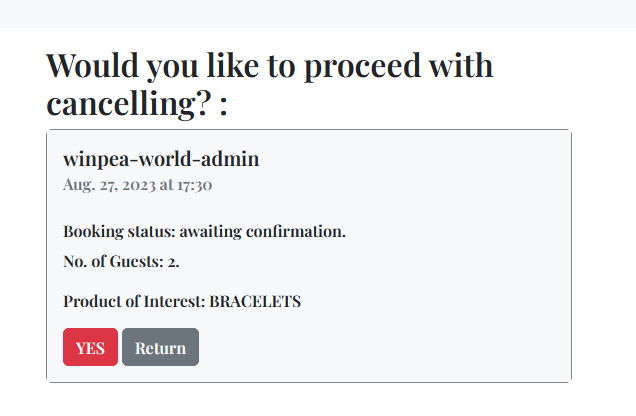

### Catalogue
- The catalogue displays all available and out of stock products
- Catalogue is categorised into each type of producet
- Items can be added via the admin panel in the backend by staff
- Staff can create, update and delete products via the admin panel
  

See feature images

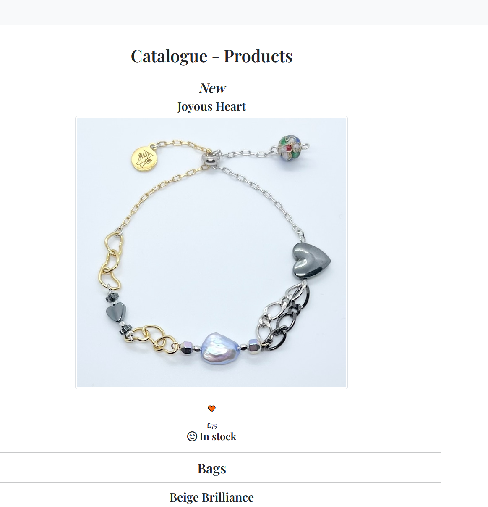

### Blog
- The blog displays each post made by a staff member
- Paginations is used to display 4 posts per page
  

See feature images

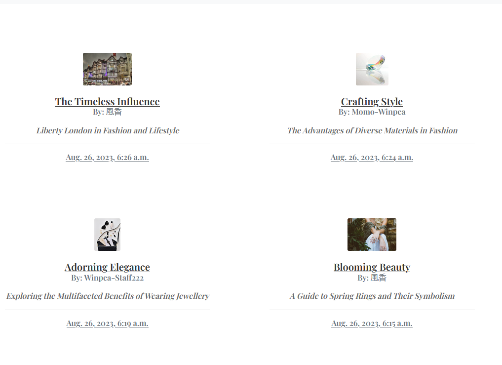

### Blog Expanded
- Expands into the selected blog the user wishes to read
- Displays a featured image uploaded by the poster
- If no image is uploaded a default image is then used
- Registered user can comment on the blog
  

See feature images

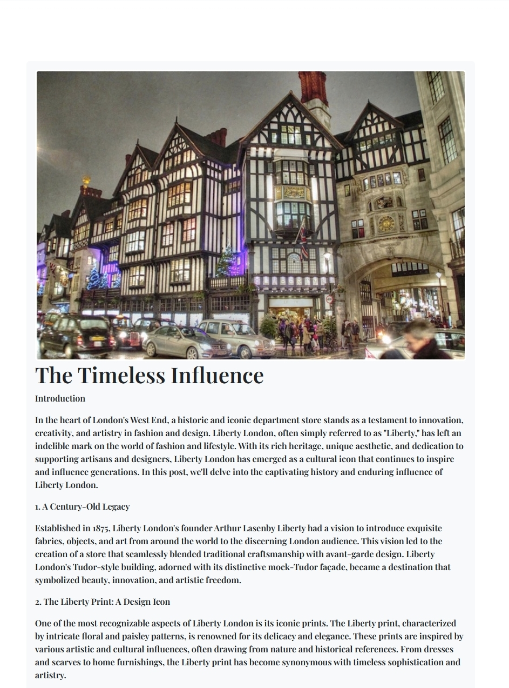

### Comments
- Comments made are set to pending approval status to ensure nothing explicit is displayed
- Only registered users can comment on a blog post
- Staff can approve comments via the admin panel on the backend
  

See feature images

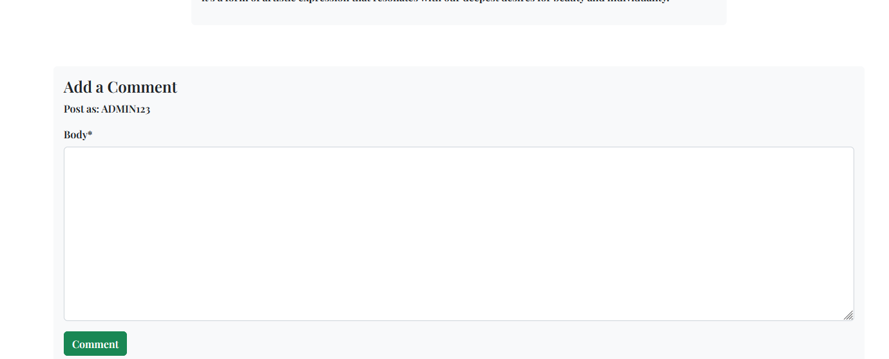

### Contact Us
- Registered users can DM staff via the message box
- Contact info such as, phone, email, and address is displayed
- A Google Map is embedded with the address for users to use
  

See feature images

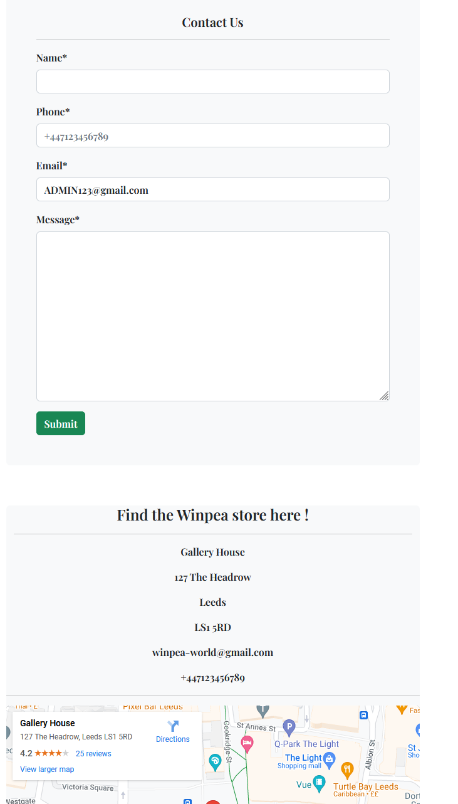

### Social Media Links
- A logo and link is used for each social media displayed
- All links open in a new tab to ensure user is not directed away from the business
- Displayed on all pages
  

See feature images

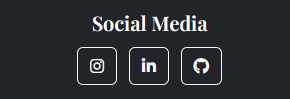

### Pagination
- Pagination is used on the bookings list and the blog page
- Ensures the page is kept tidy as only 4 items are displayed per page
  

See feature images

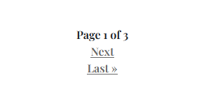

##### Back to [top](#table-of-contents)

## Validation
### HTML Validation
The W3C Markup Validation Service was used to validate the HTML code for the webiste. All pages have passed the checks and have no errors - this can be checked at any time.
- Home [results](https://validator.w3.org/nu/?doc=https%3A%2F%2Fwinpea-world-560ce7552450.herokuapp.com%2F)
- Register [results](https://validator.w3.org/nu/?doc=https%3A%2F%2Fwinpea-world-560ce7552450.herokuapp.com%2Faccounts%2Fsignup%2F)
- Login [results](https://validator.w3.org/nu/?doc=https%3A%2F%2Fwinpea-world-560ce7552450.herokuapp.com%2Faccounts%2Flogin%2F)
- Logout [results](https://validator.w3.org/nu/?doc=https%3A%2F%2Fwinpea-world-560ce7552450.herokuapp.com%2Faccounts%2Flogout%2F)
- Bookings [results](https://validator.w3.org/nu/?doc=https%3A%2F%2Fwinpea-world-560ce7552450.herokuapp.com%2Fvisit_store)
- Edit Booking [results](https://validator.w3.org/nu/?doc=https%3A%2F%2Fwinpea-world-560ce7552450.herokuapp.com%2Fedit_booking%2F15)
- Cancel Booking [results](https://validator.w3.org/nu/?doc=https%3A%2F%2Fwinpea-world-560ce7552450.herokuapp.com%2Fcancel_booking%2F15)
- Catalogue [results](https://validator.w3.org/nu/?doc=https%3A%2F%2Fwinpea-world-560ce7552450.herokuapp.com%2Fcatalogue)
- Blog [results](https://validator.w3.org/nu/?doc=https%3A%2F%2Fwinpea-world-560ce7552450.herokuapp.com%2Fblog%2F)
- Blog Expanded [results](https://validator.w3.org/nu/?showsource=yes&doc=https%3A%2F%2Fwinpea-world-560ce7552450.herokuapp.com%2Fthe-timeless-influence%2F)
- Contact us [results](https://validator.w3.org/nu/?doc=https%3A%2F%2Fwinpea-world-560ce7552450.herokuapp.com%2Fcontactus%2F)
- 404 page [results](https://validator.w3.org/nu/?doc=https%3A%2F%2Fwinpea-world-560ce7552450.herokuapp.com%2Fvisit_stores%2F) - 404 is detected

### CSS Validation
The W3C Jigsaw CSS Validation Service

style.css

### JS Validation
JSLint: The JavaScript Code Quality Coverage Tool

script.js

### PEP8 Validation
Code Institute's CI Python Linter was used to validate all Python files.

Home

views.py

urls.py

Item Catalogue

admin.py

models.py

urls.py

views.py

test-urls.py

test-views.py

Bookings

admin.py

models.py

urls.py

views.py

test-urls.py

forms.py

test-views.py

Blog

admin.py

models.py

urls.py

views.py

forms.py

Contact us

admin.py

models.py

urls.py

views.py

forms.py

### Lighthouse

Performance of the site, best practices and SEO tested.

Index

Register

Login

Logout

Catalogue

Blog

Blog Expanded

Book

Booking List

Edit Booking

Cancel Booking

Contact Us

### Wave Validation
Wave used to validate the styles, links and colours used on the site.

Index

Register

Login

Logout

Catalogue

Blog

Blog Expanded

Book

Contact Us

404

## Testing

### Manual Testing

1. As a User I can navigate across the site so that I can move to each feature of the site easily

**Step** | **Expected Result** | **Actual Result**
------------ | ------------ | ------------ |
| Click on the 'Home' link in the navigation bar | Homepage will load| Works as expected |
| Click on the 'Register' link in the navigation bar | Sign up page will load| Works as expected |
| Click on the 'Login' link in the navigation bar | Login page will load| Works as expected |
| Click on the 'Catalogue' link in the navigation bar | Catalogue page will load| Works as expected |
| Click on the 'Blog' link in the navigation bar | Blog page will load| Works as expected |
| Click on the 'Book' link in the navigation bar | Reservations page will load| Works as expected |
| Click on the 'Contact Us' link in the navigation bar | Contact us page will load| Works as expected |
| Click on the 'My Bookings' link in the navigation bar | Booking list page will load| Works as expected |
| Click on the 'Logout' link in the navigation bar | Logout page will load| Works as expected |

2. As a User I can view the opening hours and contact details so that I know when the business is open and how to contact them via email, phone and socials (Must have)

**Step** | **Expected Result** | **Actual Result**
------------ | ------------ | ------------ |
| Click on the 'Contact us' link in the navigation bar | Contact us page will load and you can view content | Works as expected |

3. As a Site Owner I can provide a contact us page so that users can get in touch with my business (Must have)

**Step** | **Expected Result** | **Actual Result**
------------ | ------------ | ------------ |
| Click on the 'Contact us' link in the navigation bar | Contact us page will load and you can view content | Works as expected |

4. As a User I can use a navbar, footer, and social icons so that I can navigate the site, access menus, and access socials (Must have)

**Step** | **Expected Result** | **Actual Result**
------------ | ------------ | ------------ |
| Click on a selection from the navigation bar | selected page will load and you can view content | Works as expected |
| Scroll to the bottom of the page | view social media content and click to go to new tab | Works as expected |

5. As a User I can create a booking by selecting a date and time so that I can reserve my slot (Must have)

**Step** | **Expected Result** | **Actual Result**
------------ | ------------ | ------------ |
| Navigate to booking page | select the time, date and slot you deserve and submit | Works as expected |

6. As a User I can update my booking so that I can choose another available time and date (Must have)

**Step** | **Expected Result** | **Actual Result**
------------ | ------------ | ------------ |
| Navigate to my bookings page | select a different available time, date and slot then re-submit | Works as expected |

7. As a User I can delete my booking so that I can cancel my slot (Must have)

**Step** | **Expected Result** | **Actual Result**
------------ | ------------ | ------------ |
| Navigate to my bookings page | click cancel booking and proceed once prompted if you want to cancel the booking | Works as expected |

8. As a user I can view my booking so that I can remind myself of the date and time I have booked (Must have)

**Step** | **Expected Result** | **Actual Result**
------------ | ------------ | ------------ |
| Navigate to my bookings page | view the content of the booking you have in displayed on the card | Works as expected |

9. As a User I can I am notified so that I know my action of creation, edit, or deletion of a booking has been successful (Must have)

**Step** | **Expected Result** | **Actual Result**
------------ | ------------ | ------------ |
| Make a successful booking | Message popup is displayed to say the action was successful | Works as expected |
| Edit a booking | Message popup is displayed to say the action was successful | Works as expected |
| Delete a booking | Message popup is displayed to say the action was successful | Works as expected |

10. As a User I can register as prompted so that I can make a booking if I wish reserve a slot (Must have)

**Step** | **Expected Result** | **Actual Result**
------------ | ------------ | ------------ |
| Navigate to book page | Message is displayed to say you need to login to book | Works as expected |

11. As a User I can register to create an account so that my details are stored for faster booking in future (Must have)

**Step** | **Expected Result** | **Actual Result**
------------ | ------------ | ------------ |
| Navigate to register page | User is able to enter details and successfully register | Works as expected |

12. As a user I can login so that I can book a slot (Must have)

**Step** | **Expected Result** | **Actual Result**
------------ | ------------ | ------------ |
| Navigate to login page | User is able to enter details and successfully login | Works as expected |

13. As a user I can see my login status so that I know if I am logged in or not (Must have)

**Step** | **Expected Result** | **Actual Result**
------------ | ------------ | ------------ |
| Home page | User is able to see they are logged in our out with the navbar element | Works as expected |

14. As a User I can view the site's blog so that I can learn additional information and read articles (Should have)

**Step** | **Expected Result** | **Actual Result**
------------ | ------------ | ------------ |
| Navigate to site's blog | User is able to see the preview of each blog | Works as expected |

15. As a User I can view the product catalogue so that I can decide whether to visit the store (Must have)

**Step** | **Expected Result** | **Actual Result**
------------ | ------------ | ------------ |
| Navigate to site's catalogue | User is able to see the products of the brand and each category | Works as expected |

16. As a User I cannot book a date in the past so that my booking is valid (Must have)

**Step** | **Expected Result** | **Actual Result**
------------ | ------------ | ------------ |
| View a expired booking | User is not able to access the booking as it is deprecated once it is expired | Works as expected |

17. As a User I can view blog posts page by page so that I can browse without seeing an overloaded page (Should have)

**Step** | **Expected Result** | **Actual Result**
------------ | ------------ | ------------ |
| View the blog page | User is able to access the blog page and have a good viewing experience with page paginator | Works as expected |

18. As a User I can not book a slot already booked so that my booking is valid and not double booked (Must have)

**Step** | **Expected Result** | **Actual Result**
------------ | ------------ | ------------ |
| Double book a slot | User is not able to book a slot that is already booked and is prompted to book another slot | Works as expected |

19. As an Admin / Authorised User I can log in so that I can access the back end of the site (Must have)

**Step** | **Expected Result** | **Actual Result**
------------ | ------------ | ------------ |
| Log in to admin panel | Admin panel is displayed with all models | Works as expected |

20. As an Admin / Authorised User I can manually add a booking so that I can book a slot if someone phones, or emails the business (Should have)

**Step** | **Expected Result** | **Actual Result**
------------ | ------------ | ------------ |
| View admin panel options and add a booking for a customer | Customer booking is succesful within admin panel and can be changed at any time | Works as expected |

21. As an Admin / Authorised User I can accept or reject bookings so that we avoid double bookings (Must have)

**Step** | **Expected Result** | **Actual Result**
------------ | ------------ | ------------ |
| View admin panel options and accept or reject bookings | Customer booking is succesful within admin panel and can be changed at any time | Works as expected |

22. As an Admin I can login to add or remove items from the product catalogue so that we can add more products or remove them (Must have)

**Step** | **Expected Result** | **Actual Result**
------------ | ------------ | ------------ |
| Login to admin panel and catalogue | Products can be adjusted to their current availability | Works as expected |

23. As a Admin I can create, read, update and delete product item from the database so that we can add, remove, rename and view all our catalogue products (Must have)

**Step** | **Expected Result** | **Actual Result**
------------ | ------------ | ------------ |
| View admin panel options and access catalogue panel to make changes | Products can be added, removed or edited at any time through admin panel | Works as expected |

24. As an Admin / Authorised User I can search through bookings and menus so that I can find the information I am looking for (Should have)

**Step** | **Expected Result** | **Actual Result**
------------ | ------------ | ------------ |
| View admin panel options and access bookings app | Panel of bookings is displayed for admin or staff use | Works as expected |

25. As an Admin / Authorised User I can filter bookings by date so that I can see what bookings we have for a particular day (Should have)

**Step** | **Expected Result** | **Actual Result**
------------ | ------------ | ------------ |
| View admin panel options and access bookings app | Panel of bookings is displayed for admin or staff use | Works as expected |

26. As a Site Owner I can provide a fully responsive site for my customers so that they have a good user experience (Must have)

**Step** | **Expected Result** | **Actual Result**
------------ | ------------ | ------------ |
| Navigate each page and test all features | Website offers its intended purpose and flows well | Works as expected |

27. As a Site Owner I can validate data entered into my site so that all submitted data is correct to avoid errors (Must have)

**Step** | **Expected Result** | **Actual Result**
------------ | ------------ | ------------ |
| Navigate each page and test all features | Website offers its intended purpose and flows well | Works as expected |
| Navigate admin panel and test all sections| Admin panel offers its intended purpose and works efficiently | Works as expected |

##### Back to [top](#table-of-contents)

## Bugs

| **Bug** | **Fix** |
| ----------- | ----------- |
| **Bug** | **Fix** |
| CSS not loading in Heroku deployment | ran collectstatic in terminal |
| Catalogue images displaying too large on mobile | Use bootstrap class img-fluid |
| Login page link not working | add the correct static link |
| All bookings were able to be viewed by all users | Add code to make sure that users could only view their own bookings |
| Users able to enter invalid content on login and register pages | add form content such as required and format |
| Double bookings | Re-coded bookings app to run a uniquetogether which checked all the date, time, slot content and told the user the booking is unavailable |

### Heroku Deployment

[Official Page](https://devcenter.heroku.com/articles/git) (Ctrl + click)

This application has been deployed from Github using Heroku. Here's how:

1. Create an account at heroku.com
2. Create an app, give it a name for such as CI_PP4_WINPEA, and select a region
3. Under resources search for postgres, and add a Postgres database to the app

Heroku Postgres

1. Note the DATABASE_URL, this can be set as an environment variable in Heroku and your local deployment(env.py)
2. Install the plugins dj-database-url and psycopg2-binary.
3. Run pip3 freeze > requirements.txt so both are added to the requirements.txt file
4. Create a Procfile with the text: web: gunicorn the_diplomat.wsgi
5. In the settings.py ensure the connection is to the Heroku postgres database, no indentation if you are not using a seperate test database.
I store mine in env.py
6. Ensure debug is set to false in the settings.py file
7. Add localhost, and ci-pp4-the-diplomat.herokuapp.com to the ALLOWED_HOSTS variable in settings.py
8. Run "python3 manage.py showmigrations" to check the status of the migrations
9. Run "python3 manage.py migrate" to migrate the database
10. Run "python3 manage.py createsuperuser" to create a super/admin user
11. Run "python3 manage.py loaddata categories.json" on the categories file in products/fixtures to create the categories
12. Run "python3 manage.py loaddata products.json" on the products file in products/fixtures to create the products
13. Install gunicorn and add it to the requirements.txt file using the command pip3 freeze > requirements.txt
14. Disable collectstatic in Heroku before any code is pushed using the command heroku config:set DISABLE_COLLECTSTATIC=1 -a CI_PP4_WINPEA
15. Ensure the correct environment variables are set in Heroku
16. Connect the app to GitHub, and enable automatic deploys from main if you wish
17. Click deploy to deploy your application to Heroku for the first time
18. Click on the link provided to access the application
19. If you encounter any issues accessing the build logs is a good way to troubleshoot the issue

### Fork Repository
To fork the repository by following these steps:
1. Go to the GitHub repository
2. Click on Fork button in upper right hand corner

### Clone Repository
You can clone the repository by following these steps:
1. Go to the GitHub repository 
2. Locate the Code button above the list of files and click it 
3. Select if you prefere to clone using HTTPS, SSH, or Github CLI and click the copy button to copy the URL to your clipboard
4. Open Git Bash
5. Change the current working directory to the one where you want the cloned directory
6. Type git clone and paste the URL from the clipboard ($ git clone https://github.com/YOUR-USERNAME/YOUR-REPOSITORY)
7.Press Enter to create your local clone.

##### Back to [top](#table-of-contents)

### Media
- [Favicon](https://favicon.io/)
- [Images](https://www.pexels.com/)

### Code
Bootstrap classes such as img-fluid & carousel used.

## Acknowledgements

### Special thanks to the following:
- Code Institute
- Mo Shami
- My friends, family and my wonderful wife.

